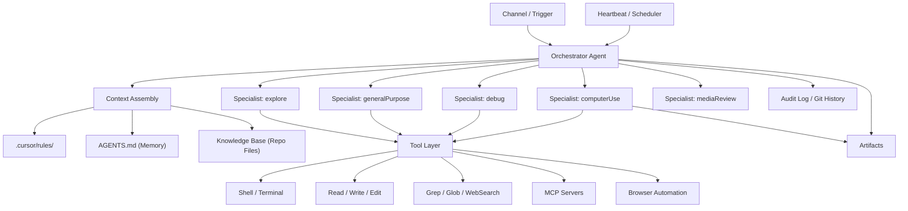

# #Claw Agentic Workflow Plan

## How to Use Cursor + AGENTS as Your Own OpenClaw Alternative

---

## Executive Summary

This document maps the architecture and capabilities of **OpenClaw** (the open-source multi-agent framework) onto **Cursor IDE + Cloud Agents**, showing how to replicate and extend an agentic workflow system entirely within Cursor's native tooling. The plan uses the ontology from this repository's Context Engineering Comprehensive Plan as its structural foundation.

OpenClaw provides: a Gateway (orchestrator), a Brain (LLM reasoning), Hands (execution tools), Memory (persistent Markdown files), a Heartbeat (autonomous scheduler), and Skills (modular abilities). Every one of these components has a direct mapping to Cursor's existing architecture -- and in several areas Cursor exceeds OpenClaw's capabilities because it operates with deep codebase awareness that OpenClaw lacks.

---

## 1. Conceptual Mapping: OpenClaw Architecture to Cursor + AGENTS

### 1.1 Component-by-Component Equivalence Table

| OpenClaw Component | What It Does | Cursor + AGENTS Equivalent | How to Implement |
|--------------------|-------------|---------------------------|------------------|
| **Gateway** | Central daemon that orchestrates agents | **Cursor Cloud Agent** | The Cloud Agent runtime is the orchestrator -- it receives tasks, manages subagents, and coordinates execution |
| **Brain** | LLM reasoning engine (Claude, GPT, Gemini) | **Model selection per subagent** | Cursor supports multiple models; each subagent can use a different model (fast, default, capable) |
| **Hands** | Shell access, file system, browser automation | **Shell + Read/Write + computerUse subagent** | Shell tool runs commands; Read/Write/StrReplace handle files; computerUse subagent drives the browser |
| **Memory** | Persistent local Markdown files | **AGENTS.md + `.cursor/rules/` + repo files** | Long-term memory lives in AGENTS.md and rule files; project knowledge lives in the repository itself |
| **Heartbeat** | Autonomous scheduled loop (every 30 min) | **Cloud Agent sessions + CI/CD triggers** | GitHub Actions or scheduled Cloud Agent sessions replicate periodic autonomous behavior |
| **Skills** | Modular abilities (3,500+ available) | **MCP servers + subagent types + `.cursor/rules/`** | MCP tools extend capabilities; rules encode domain knowledge; subagent types provide specialized skills |
| **Channels** | Messaging platform integration (Telegram, etc.) | **GitHub Issues/PRs + webhooks** | Cloud Agents are triggered by GitHub events; webhook integrations extend to Slack, Discord, etc. |
| **Dashboard** | Web UI for monitoring agents | **Cursor Cloud UI + GitHub Actions logs** | The Cursor web interface shows agent sessions; GitHub provides audit trails |

### 1.2 Architectural Diagram: Cursor as #Claw

```
 YOUR #CLAW SYSTEM (Built with Cursor + AGENTS)
 ================================================

 ┌──────────────────────────────────────────────────────────────────┐
 │                    TRIGGER LAYER (= OpenClaw Channels)           │
 │  GitHub Issue/PR  |  Manual Chat  |  CI/CD Schedule  |  Webhook │
 └────────┬─────────────────┬──────────────┬──────────────┬────────┘
          │                 │              │              │
          ▼                 ▼              ▼              ▼
 ┌──────────────────────────────────────────────────────────────────┐
 │              CURSOR CLOUD AGENT (= OpenClaw Gateway)             │
 │                                                                  │
 │  ┌────────────┐  ┌──────────────┐  ┌──────────────────────────┐ │
 │  │ AGENTS.md  │  │ .cursor/     │  │ Context Engineering      │ │
 │  │ (Memory)   │  │ rules/       │  │ (Ontology + Rules)       │ │
 │  │            │  │ (Governance) │  │                          │ │
 │  └────────────┘  └──────────────┘  └──────────────────────────┘ │
 │                                                                  │
 │  ┌──────────────────────────────────────────────────────────────┐│
 │  │              SUBAGENT POOL (= OpenClaw Multi-Agent)          ││
 │  │                                                              ││
 │  │  ┌──────────────┐  ┌──────────────┐  ┌──────────────┐      ││
 │  │  │ generalPurp. │  │   explore    │  │    debug     │      ││
 │  │  │ (Researcher) │  │  (Scout)     │  │ (Diagnostics)│      ││
 │  │  └──────────────┘  └──────────────┘  └──────────────┘      ││
 │  │                                                              ││
 │  │  ┌──────────────┐  ┌──────────────┐  ┌──────────────┐      ││
 │  │  │ computerUse  │  │ mediaReview  │  │vmSetupHelper │      ││
 │  │  │ (Browser/GUI)│  │  (Visual QA) │  │ (DevOps)     │      ││
 │  │  └──────────────┘  └──────────────┘  └──────────────┘      ││
 │  └──────────────────────────────────────────────────────────────┘│
 │                                                                  │
 │  ┌──────────────────────────────────────────────────────────────┐│
 │  │                TOOL LAYER (= OpenClaw Hands + Skills)        ││
 │  │                                                              ││
 │  │  Shell  | Read/Write | Grep/Glob | WebSearch | MCP Servers  ││
 │  │  Git    | RecordScreen | TodoWrite | Task (spawn agents)    ││
 │  └──────────────────────────────────────────────────────────────┘│
 └──────────────────────────────────────────────────────────────────┘
```

---

## 2. Extended Ontology: #Claw Entities

Building on the Scheme Ontology from Section 5 of `CONTEXT_ENGINEERING_COMPREHENSIVE_PLAN.md`, these additional entities model the #Claw agentic workflow:

| Entity | Definition | OpenClaw Equivalent | Cursor Implementation |
|--------|-----------|---------------------|----------------------|
| **Orchestrator** | The master agent coordinating all work | Gateway daemon | Cloud Agent main process |
| **Specialist** | A focused subagent with a narrow role | Agent persona in a session | Subagent (explore, debug, computerUse, etc.) |
| **Skill** | A reusable, modular capability | Installable skill from ClaHub | `.cursor/rules/` file or MCP server tool |
| **Channel** | An input/output interface to the external world | Telegram/WhatsApp/Discord bridge | GitHub event, webhook, or manual chat |
| **Session** | A stateful conversation with memory | OpenClaw session with history | Cloud Agent session with AGENTS.md persistence |
| **Heartbeat** | Autonomous periodic execution | 30-minute cron loop | GitHub Actions scheduled workflow |
| **Artifact** | A produced output (code, doc, image, video) | Generated file or message | `/opt/cursor/artifacts/` output or committed file |

### 2.1 Entity Relationships (Extended)



---

## 3. Building Your #Claw: Step-by-Step Implementation Plan

### Phase 1: Foundation -- Memory & Governance Layer

**Goal:** Establish persistent memory and rule-based governance that survives across sessions.

**OpenClaw equivalent:** Memory system (Markdown files) + Skills installation.

#### 3.1.1 Create the Memory Structure

```
your-project/
├── AGENTS.md                          # Agent operating memory
├── .cursor/
│   └── rules/
│       ├── always/
│       │   ├── security.mdc           # Never commit secrets, validate inputs
│       │   └── code-style.mdc         # TypeScript strict, ESLint, naming
│       ├── auto-attached/
│       │   ├── frontend.mdc           # React/component standards
│       │   ├── backend.mdc            # API design patterns
│       │   └── database.mdc           # Schema, migrations, queries
│       ├── agent-requested/
│       │   ├── performance.mdc        # Optimization guidelines
│       │   └── security-advanced.mdc  # JWT, rate limiting, encryption
│       └── manual/
│           └── legacy-refactor.mdc    # Migration/deprecation rules
├── docs/
│   ├── memory/
│   │   ├── preferences.md            # User/team preferences
│   │   ├── decisions.md              # Architecture Decision Records
│   │   └── contacts.md               # Team roles and responsibilities
│   └── skills/
│       ├── testing-skill.md           # How to test in this project
│       ├── deployment-skill.md        # How to deploy
│       └── review-skill.md           # How to do code review
```

**Why this matters:** OpenClaw stores memory as local Markdown files that persist across restarts. Cursor does the same thing -- `AGENTS.md` and `.cursor/rules/` files are read at the start of every session. Your rules ARE your installed skills.

#### 3.1.2 Write Your AGENTS.md (= OpenClaw Memory)

The `AGENTS.md` file serves the same role as OpenClaw's persistent memory. Structure it with:

- **Project identity:** What this project is, who it serves
- **Operational context:** How to build, test, deploy
- **Learned facts:** Non-obvious gotchas discovered over time
- **Skill references:** Pointers to detailed skill files in `docs/skills/`

#### 3.1.3 Write Your Rules (= OpenClaw Skills)

Each `.cursor/rules/*.mdc` file is equivalent to an installed OpenClaw skill. The rule triggers automatically based on context, just like OpenClaw skills activate based on the situation.

**Template for converting an OpenClaw skill to a Cursor rule:**

```markdown
---
description: [Skill purpose in one sentence]
alwaysApply: false
globs: ["relevant/file/patterns/**/*.ts"]
---

# [Skill Name]

## When to activate
- [Conditions that make this skill relevant]

## Standards
### Do
- [Specific, actionable instruction]

### Don't
- [Anti-pattern to avoid]

## Examples
### Good
[Concrete example of correct behavior]

### Bad
[Concrete example of what to avoid]
```

---

### Phase 2: Multi-Agent Orchestration

**Goal:** Replicate OpenClaw's multi-agent coordination using Cursor's subagent system.

**OpenClaw equivalent:** Multi-session gateway with `sessions_list`, `sessions_history`, `sessions_send`.

#### 3.2.1 Define Your Agent Roster

Map your workflow roles to Cursor subagent types:

| Your #Claw Role | Cursor Subagent | When to Deploy |
|-----------------|-----------------|----------------|
| **Researcher** | `explore` | Codebase analysis, finding patterns, answering "where/what/how" questions |
| **Implementer** | `generalPurpose` | Multi-step coding tasks, refactoring, feature implementation |
| **Debugger** | `debug` | Hypothesis-driven bug investigation with instrumentation |
| **Tester** | `computerUse` | GUI-based manual testing, browser automation, visual verification |
| **Reviewer** | `mediaReview` | Visual QA, screenshot comparison, UI audit |
| **DevOps** | `vmSetupHelper` | Environment setup, dependency discovery, infrastructure |

#### 3.2.2 Orchestration Patterns

**Pattern A: Parallel Research (= OpenClaw multi-session)**

Launch multiple explore agents simultaneously to gather information from different parts of the codebase:

```
Orchestrator receives task: "Add dark mode to the app"
  ├─> explore agent 1: "Find all color/theme definitions"
  ├─> explore agent 2: "Find existing theme switching logic"
  ├─> explore agent 3: "Check for CSS variable usage patterns"
  └─> explore agent 4: "Find user preference storage mechanism"

All return findings → Orchestrator synthesizes → Implementation plan
```

**Pattern B: Pipeline (= OpenClaw research-develop-deploy)**

Chain agents sequentially where each depends on the previous:

```
explore (understand) → generalPurpose (implement) → debug (verify) → computerUse (test)
```

**Pattern C: Specialist Delegation (= OpenClaw agent-to-agent)**

The main agent delegates focused tasks to specialists and integrates their results:

```
Orchestrator: "Fix the login bug"
  └─> debug agent: instruments code, identifies root cause
      └─> returns: "Root cause is X in file Y at line Z"
  └─> Orchestrator: applies fix based on debug findings
  └─> computerUse agent: reproduces original bug scenario
      └─> returns: "Bug no longer reproducible, login works"
  └─> Orchestrator: commits fix with evidence
```

#### 3.2.3 Concurrency Rules

- Launch up to **4 subagents concurrently** (Cursor limit)
- Only the `debug` and `computerUse` subagents are stateful (auto-resume)
- All other subagents start fresh -- include full context in each prompt
- Use TodoWrite to coordinate state across sequential agent calls

---

### Phase 3: Tool Layer (= OpenClaw Hands)

**Goal:** Map OpenClaw's execution capabilities to Cursor's tool set.

#### 3.3.1 Core Tool Mapping

| OpenClaw Capability | Cursor Tool | Notes |
|---------------------|-------------|-------|
| Run shell commands | `Shell` | Full terminal access with state persistence |
| Read/write files | `Read` / `Write` / `StrReplace` | File operations without shell |
| Browse the web | `computerUse` subagent | Chrome automation via browser |
| Search the internet | `WebSearch` | Real-time web search for current info |
| Search codebase | `Grep` / `Glob` | Fast regex and pattern-based search |
| API calls | `Shell` (curl/httpie) + MCP servers | Direct HTTP calls or structured MCP tools |
| Git operations | `Shell` (git CLI) + `gh` CLI | Full git and GitHub CLI access |
| Screen recording | `RecordScreen` | Video capture for walkthroughs |
| Task management | `TodoWrite` | Structured task tracking |
| Image/video analysis | `mediaReview` subagent | Visual content analysis |

#### 3.3.2 Extending with MCP Servers (= OpenClaw ClaHub Skills)

MCP (Model Context Protocol) servers are the direct equivalent of OpenClaw's installable skills from ClaHub. They extend the agent's tool library with custom capabilities.

To add a new "skill" to your #Claw system:

1. **Find or build an MCP server** that provides the capability you need
2. **Configure it** in your Cursor settings (`.cursor/mcp.json`)
3. **Document it** in a `.cursor/rules/agent-requested/` rule file so the agent knows when and how to use it

Common MCP servers that replicate popular OpenClaw skills:

| OpenClaw Skill Category | MCP Server Alternative |
|------------------------|----------------------|
| Image generation (fal-ai) | fal-ai MCP or DALL-E MCP |
| Database queries | Postgres/SQLite MCP server |
| File search/RAG | Vector store MCP server |
| Calendar/scheduling | Google Calendar MCP |
| Email operations | Gmail/SMTP MCP server |
| Smart home control | Home Assistant MCP |

---

### Phase 4: Autonomous Behavior (= OpenClaw Heartbeat)

**Goal:** Replicate OpenClaw's autonomous loop for proactive agent behavior.

**OpenClaw equivalent:** The Heartbeat (default every 30 minutes) that monitors, checks, and acts autonomously.

#### 3.4.1 GitHub Actions as Heartbeat

Create scheduled workflows that trigger Cloud Agent sessions:

```yaml
# .github/workflows/heartbeat.yml
name: "#Claw Heartbeat"

on:
  schedule:
    - cron: '0 */6 * * *'    # Every 6 hours
  workflow_dispatch:           # Manual trigger

jobs:
  heartbeat:
    runs-on: ubuntu-latest
    steps:
      - uses: actions/checkout@v4
      - name: Run maintenance checks
        run: |
          # Dependency audit
          # Security scan
          # Documentation freshness check
          # Test suite health check
```

#### 3.4.2 Event-Driven Triggers (= OpenClaw Channel Monitoring)

```yaml
# .github/workflows/agent-triggers.yml
name: "#Claw Event Handlers"

on:
  issues:
    types: [opened, labeled]
  pull_request:
    types: [opened, synchronize, review_requested]
  issue_comment:
    types: [created]
```

---

### Phase 5: Context Engineering Integration

**Goal:** Wire the #Claw system into the Context Engineering Framework from this repository.

This phase connects the #Claw implementation to the five-phase context loop defined in `CONTEXT_ENGINEERING_COMPREHENSIVE_PLAN.md`:

#### 3.5.1 Context Loop Mapping

| Context Engineering Phase | #Claw Implementation |
|--------------------------|---------------------|
| **Deconstruction** | Agent reads the task, AGENTS.md, and relevant rules to understand intent |
| **Assembly** | explore subagents gather codebase context; WebSearch gathers external info |
| **Reasoning & Planning** | TodoWrite creates a structured plan; agent formulates approach |
| **Execution** | generalPurpose/debug/computerUse subagents perform the work |
| **Integration & Iteration** | Results update AGENTS.md memory; git commits capture state; artifacts demonstrate work |

#### 3.5.2 Context Components in #Claw

| Context Component | Where It Lives |
|-------------------|---------------|
| Instructions & System Prompt | `.cursor/rules/always/` |
| State & Conversational History | Cloud Agent session context |
| Long-Term Memory | `AGENTS.md` + `docs/memory/` |
| Retrieved Information (RAG) | WebSearch + MCP retrieval tools + Grep/Glob |
| Available Tools | Shell, Read/Write, MCP servers, subagents |
| Structured Output Requirements | Rule files defining expected output formats |

---

## 4. State-of-the-Art Alternatives Comparison

### 4.1 Framework Landscape (February 2026)

| Framework | Type | Language | Best For | Key Strength | Key Limitation |
|-----------|------|----------|----------|-------------|----------------|
| **OpenClaw** | Personal agent | TypeScript | Daily automation, messaging | 3,500+ skills, 50+ channels, local-first | Not IDE-native; no codebase awareness |
| **Cursor + AGENTS** | IDE agent | Any | Software development, code-centric workflows | Deep repo awareness, multi-file edits, subagent system | IDE-bound; no native messaging channels |
| **CrewAI** | Multi-agent framework | Python | Team-based AI workflows | Intuitive crew mental model, visual builder | Python-only, no persistent memory |
| **LangGraph** | Stateful graph framework | Python | Complex multi-step pipelines | Maximum control, human-in-the-loop checkpoints | Steep learning curve, verbose |
| **AutoGen** | Multi-agent conversation | Python | Research, complex reasoning | Flexible conversation topologies, Microsoft backing | Token-heavy, complex setup |
| **Claude Code** | CLI agent | Any | Terminal-first development | Fast, lightweight, agentic coding from terminal | No GUI, limited orchestration |

### 4.2 When Each Alternative Wins

**Choose OpenClaw when:**
- You need multi-platform messaging integration (Telegram, WhatsApp, Discord)
- Your workflows involve non-coding automation (smart home, email, calendar)
- You want a personal AI assistant that runs 24/7 on your machine
- Privacy/local-first is non-negotiable

**Choose Cursor + AGENTS (#Claw) when:**
- Your primary workflow is software development
- You need deep codebase awareness and multi-file editing
- You want visual testing via browser automation
- You need rule-based governance and team standardization
- Your "agents" operate on code, documentation, and development artifacts

**Choose CrewAI/LangGraph when:**
- You're building a standalone multi-agent application (not IDE-bound)
- You need custom agent topologies (hierarchical, sequential, parallel)
- Your agents will be deployed as a service, not used interactively

### 4.3 Hybrid Architecture: #Claw + OpenClaw

The most powerful configuration combines both:

```
┌─────────────────────────────┐     ┌─────────────────────────────┐
│    Cursor + AGENTS (#Claw)  │     │         OpenClaw            │
│                             │     │                             │
│  - Code implementation      │◄───►│  - Messaging channels       │
│  - Codebase analysis        │     │  - Smart home / IoT         │
│  - Testing & QA             │     │  - Email / calendar         │
│  - Git & deployment         │     │  - Monitoring & alerts      │
│  - Documentation            │     │  - Non-code automation      │
│                             │     │                             │
│  Governed by .cursor/rules/ │     │  Governed by OpenClaw skills│
└──────────────┬──────────────┘     └──────────────┬──────────────┘
               │                                   │
               └──────────┬───────────────────────┘
                          │
                 ┌────────▼────────┐
                 │  Shared Memory  │
                 │  (Git repo +    │
                 │   AGENTS.md)    │
                 └─────────────────┘
```

---

## 5. SWOT Analysis: Cursor #Claw vs OpenClaw

### Strengths (Cursor #Claw)
- Deep codebase awareness -- understands file relationships, imports, types
- Multi-file editing with AST-level intelligence
- Built-in visual testing via computerUse subagent
- Rule-based governance with hierarchical scoping
- Git-native: every action is version-controlled
- Model flexibility: switch between Claude, GPT, Gemini per task

### Weaknesses (Cursor #Claw)
- IDE-bound -- cannot run as a standalone daemon
- No native messaging platform integration
- No built-in scheduler/heartbeat (requires external CI/CD)
- Subagent limit of 4 concurrent agents
- Cloud Agent sessions are task-scoped, not persistent background processes

### Opportunities
- MCP ecosystem is rapidly expanding, closing the skills gap
- GitHub Actions provide a mature scheduling and event system
- Cursor's rule system can encode any domain expertise as persistent skills
- The hybrid architecture (Cursor + OpenClaw) covers all use cases

### Threats
- Token cost cliffs at 100k-400k tokens per complex agent request
- Vendor lock-in to Cursor's cloud infrastructure
- Rapidly evolving landscape -- new frameworks emerge monthly
- OpenClaw's 3,500+ skill library provides breadth that's hard to replicate

---

## 6. Implementation Checklist

### Week 1: Foundation
- [ ] Create `.cursor/rules/always/` with security and code-style rules
- [ ] Create `.cursor/rules/auto-attached/` for file-pattern-specific standards
- [ ] Write `AGENTS.md` with project identity, build/test/deploy instructions
- [ ] Create `docs/skills/` directory with skill files for key workflows
- [ ] Create `docs/memory/` directory for persistent learned facts

### Week 2: Multi-Agent Patterns
- [ ] Define your agent roster (which subagent types you'll use and when)
- [ ] Write orchestration prompts for your 3 most common workflows
- [ ] Document the parallel research pattern for your codebase
- [ ] Document the pipeline pattern for your development cycle
- [ ] Test each pattern with a real task

### Week 3: Tool Extension
- [ ] Identify 3-5 MCP servers that extend your capabilities
- [ ] Configure MCP servers in `.cursor/mcp.json`
- [ ] Write agent-requested rules documenting when to use each MCP tool
- [ ] Test end-to-end workflows using MCP tools

### Week 4: Automation & Governance
- [ ] Create GitHub Actions heartbeat workflow for periodic maintenance
- [ ] Create event-driven workflows for issue/PR triggers
- [ ] Establish audit logging via git history + AGENTS.md updates
- [ ] Write governance rules for critical decision routing
- [ ] Document the complete #Claw system in this plan

---

## 7. Quick Reference: OpenClaw Command to Cursor Equivalent

| OpenClaw Command | What It Does | Cursor #Claw Equivalent |
|-----------------|-------------|------------------------|
| `openclaw onboard` | Initial setup | Create AGENTS.md + `.cursor/rules/` |
| `openclaw dashboard` | Monitor agents | Cursor Cloud UI + git log |
| `openclaw channel add telegram` | Add messaging | GitHub webhook + Actions |
| `clawhub install fal-ai` | Install a skill | Add MCP server + write rule file |
| `sessions_list` | List active agents | TodoWrite to track active subagents |
| `sessions_send` | Send message between agents | Spawn subagent with context from previous agent's output |
| `sessions_history` | View agent conversation | Read Cloud Agent session transcript |

---

## 8. Conclusion

Cursor + AGENTS provides a complete substrate for building your own #Claw agentic workflow system, with particular strength in **code-centric workflows** where deep codebase awareness, multi-file editing, and visual testing are essential.

The key insight: **OpenClaw excels at breadth** (3,500+ skills, 50+ messaging channels, 24/7 daemon), while **Cursor #Claw excels at depth** (repo-aware reasoning, rule-based governance, subagent specialization, visual QA). The optimal strategy for most development teams is to build the #Claw system within Cursor for all software engineering workflows, and optionally integrate OpenClaw for non-code automation and messaging.

---

**Document Version:** 1.0
**Created:** February 26, 2026
**Ontology Source:** `CONTEXT_ENGINEERING_COMPREHENSIVE_PLAN.md` (Sections 1, 4, 5, 9)
**Research Date:** February 2026
