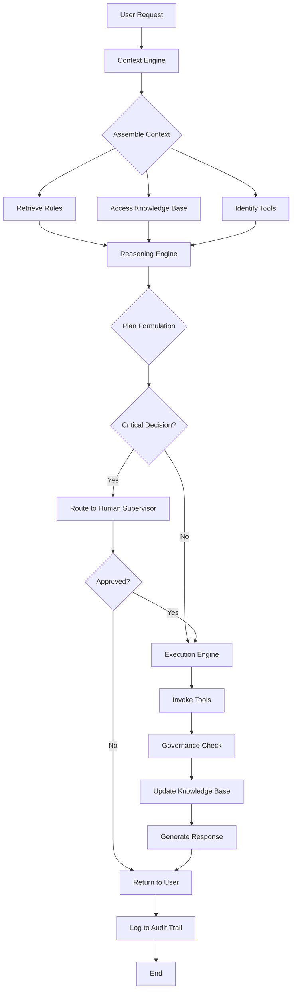

## Executive Summary

This document provides a comprehensive context engineering plan for the Cursor AI workspace project. It synthesizes insights from email communications, product requirements documentation, project rules, and prompt command analysis to establish a structured approach for implementing an AI-enabled workspace that balances flexibility with collaboration, while maintaining trust through transparency and human oversight.

The plan addresses the core challenge of designing an AI agent that can operate as a "trusted AI employee" within an organization, equipped with appropriate skillsets, trained on company data, governed by clear access controls, and subject to continuous review and human supervision.

---

## 1. Context Engineering Framework

Context engineering represents a systematic methodology for designing and managing the informational environment that guides AI agent behavior. Rather than relying on a single prompt or instruction, context engineering assembles a rich, multi-layered information structure that includes system instructions, conversational history, long-term memory, retrieved knowledge, available tools, and structured output requirements.

### 1.1 Core Context Loop

The context engineering loop operates through five iterative phases:

**Deconstruction:** The AI agent analyzes the user's request to identify the ultimate goal, key entities, implicit intent, and success criteria. This phase involves breaking down complex requests into their constituent parts to understand what the user truly needs.

**Assembly:** The agent dynamically gathers and structures information from all available sources relevant to the immediate task. This includes accessing the knowledge base, retrieving relevant documents, identifying applicable rules, and determining which tools will be necessary.

**Reasoning & Planning:** Based on the assembled context, the agent formulates a step-by-step plan. It determines whether sufficient information exists to proceed or whether additional data must be retrieved through tool invocation.

**Execution:** The agent invokes appropriate tools, generates responses, or takes actions based on its plan. This phase represents the actual work being performed.

**Integration & Iteration:** The results of execution are integrated back into the context. New information updates the knowledge base, and the loop continues until the user's goal is fully accomplished.

### 1.2 Context Components

The context available to the AI agent comprises six essential components:

**Instructions & System Prompt:** These define the high-level behavior, operational principles, and persona of the agent. Instructions serve as the foundational operating guidelines throughout the entire task lifecycle.

**State & Conversational History:** The immediate conversational history provides context for understanding the flow of the current interaction, resolving pronouns, and maintaining coherence. This short-term memory prevents repetition and enables natural dialogue.

**Long-Term Memory:** Persistent knowledge about the user, past projects, and explicit facts enables personalization and contextual awareness. This memory layer allows the agent to build on previous interactions and maintain consistency over time.

**Retrieved Information (RAG):** External, up-to-date knowledge from documents, databases, and APIs supplements the agent's internal knowledge. When user queries require factual information not in memory, retrieval mechanisms fetch and synthesize this information with proper attribution.

**Available Tools:** The tool library defines functions the agent can invoke to interact with external systems. Tool schemas serve as contracts for action, specifying inputs, outputs, and expected behavior.

**Structured Output Requirements:** Defined formats for final responses ensure that outputs meet user expectations and can be integrated into downstream systems. Output schemas guide information gathering and presentation.

---

## 2. Product Requirements Document (PRD)

### 2.1 Overview

The Cursor workspace project aims to create an AI-enabled development environment that serves as a highly flexible, personal AI workspace while maintaining enterprise-grade security, governance, and human oversight. The product bridges the gap between individual augmentation and organizational control.

### 2.2 User Stories

- As a developer, I want to use Cursor as my primary IDE so that I can leverage AI assistance while maintaining full control over my codebase and context.
- As a team lead, I want to establish rules and governance for AI usage so that the team maintains consistent standards and security practices.
- As an organization, I want to ensure AI agents operate as "trusted employees" so that we can confidently delegate tasks while maintaining oversight and compliance.

### 2.3 Functional Requirements

**Flexible Context Management:** The system must support working with any files, setting any context, and using any AI model. Users should be able to specify custom instructions and maintain project-specific configurations.

**Rule-Based Governance:** The system must enforce project rules automatically, with rules organized hierarchically and applicable at different scopes (always, auto-attached, agent-requested, manual).

**Transparent Training & Verification:** The system must support training AI models on company-specific data with transparent, auditable processes. Users should be able to verify that the AI has been trained appropriately.

**Access Control & Security:** The system must implement security protocols that govern what data the AI can access, what operations it can perform, and what information it can retrieve.

**Continuous Monitoring & Feedback:** The system must provide mechanisms for continuous review of AI outputs, with evaluation metrics and auditable steps for all significant actions.

**Human-in-the-Loop for Critical Decisions:** The system must route critical decisions to human supervisors for approval, ensuring that important choices remain under human control.

### 2.4 Non-Functional Requirements

**Performance:** Response time for AI-assisted operations should be less than 200 milliseconds for interactive tasks.

**Security:** The system must comply with OWASP standards and implement encryption for sensitive data.

**Scalability:** The system should support organizations with up to 10,000 concurrent users.

**Accessibility:** The interface should comply with WCAG 2.1 AA standards.

**Auditability:** All significant operations must be logged with sufficient detail for compliance audits.

### 2.5 Success Metrics

- User adoption rate among target developer population
- Reduction in time-to-completion for development tasks
- Accuracy of AI-generated code and recommendations
- Security incident rate related to AI operations
- User satisfaction with AI assistance quality
- Compliance audit pass rate

### 2.6 Dependencies

**External Services:** Integration with AI model providers (OpenAI, Anthropic, Hugging Face), version control systems (GitHub, GitLab), and authentication services.

**Internal Systems:** Connection to company knowledge bases, documentation systems, and security infrastructure.

**Third-Party Libraries:** Development frameworks, security libraries, and monitoring tools.

---

## 3. Project Rules

### 3.1 Rule System Architecture

Project rules form the foundation of consistent AI-assisted development. The rule system is organized hierarchically with four categories:

```
.cursor/rules/
├── always/              # Applied to every AI interaction
├── auto-attached/       # Applied based on file patterns
├── agent-requested/     # AI decides when to apply
└── manual/             # Only when explicitly referenced
```

### 3.2 Always Rules (Universal Standards)

These rules apply to every AI interaction and establish non-negotiable standards:

- Never commit secrets or API keys to version control
- Always handle errors explicitly with proper logging and user feedback
- Use TypeScript strict mode for all TypeScript code
- Follow the project's ESLint configuration without exceptions
- Include unit tests for all new functions with minimum 80% code coverage
- Implement input validation using Zod or similar schema validation libraries
- Use parameterized queries for all database operations

### 3.3 Auto-Attached Rules

These rules apply automatically based on file patterns and context:

**Frontend Component Rules** (applies to `src/components/**/*.tsx`):
- Use functional components exclusively
- Implement proper TypeScript props with interface definitions
- Include Storybook stories for all components
- Use CSS modules for styling to prevent naming conflicts
- Follow atomic design principles for component organization

**Backend API Rules** (applies to `src/api/**/*.ts`):
- Use RESTful conventions for endpoint design
- Implement comprehensive error handling with typed error responses
- Include OpenAPI documentation for all endpoints
- Validate all inputs with Zod schemas
- Return consistent response formats with success, data, and error fields

**Database Rules** (applies to `src/db/**/*.ts` and `prisma/**/*`):
- Use migrations for all schema changes
- Never use raw SQL in application code
- Implement soft deletes for data retention
- Add indexes for all foreign keys
- Use transactions for multi-table updates

### 3.4 Agent-Requested Rules

These rules are applied when the AI agent determines they are relevant:

**Performance Optimization Guidelines:**
- Profile code before optimizing to identify actual bottlenecks
- Document all performance improvements with before/after metrics
- Consider memory versus CPU tradeoffs explicitly
- Use caching strategically with clear cache invalidation strategies
- Implement lazy loading for large datasets

**Security Best Practices:**
- Use JWT tokens with 15-minute expiration for access tokens
- Implement refresh token rotation with 7-day expiration
- Store sensitive data exclusively in environment variables
- Hash passwords with bcrypt using minimum 10 rounds
- Sanitize all user inputs before processing
- Implement rate limiting on authentication endpoints

### 3.5 Manual Rules

These rules are referenced explicitly when needed:

**Legacy Code Guidelines:**
- Maintain backward compatibility when refactoring legacy systems
- Add deprecation warnings before removing functionality
- Create migration guides for users of deprecated features
- Test extensively before refactoring critical systems

---

## 4. Architecture

### 4.1 System Architecture Overview

The Cursor context engineering architecture is built on the "Trusted AI Employee" model, which emphasizes transparency, governance, and human oversight. The system comprises five interconnected layers:

```
┌─────────────────────────────────────────────────────────┐
│              User Interface & IDE                        │
├─────────────────────────────────────────────────────────┤
│         Context Assembly & Management Layer              │
├─────────────────────────────────────────────────────────┤
│      Reasoning Engine & Planning Layer                   │
├─────────────────────────────────────────────────────────┤
│         Execution & Tool Invocation Layer                │
├─────────────────────────────────────────────────────────┤
│    Knowledge Base & External Integration Layer           │
└─────────────────────────────────────────────────────────┘
```

### 4.2 Core Components

**Context Engine:** Responsible for assembling and managing the informational context for each task. This component retrieves relevant rules, accesses the knowledge base, identifies applicable tools, and structures the context for the reasoning engine.

**Reasoning Engine:** Analyzes the assembled context and formulates step-by-step plans. This component determines whether sufficient information exists to proceed, identifies dependencies, and prioritizes actions.

**Execution Engine:** Invokes tools, generates responses, and takes actions based on the reasoning engine's plan. This component handles error recovery and manages the execution lifecycle.

**Knowledge Base:** Stores long-term memory including user preferences, project history, learned patterns, and organizational knowledge. This layer supports both retrieval and continuous learning.

**Tool Library:** A collection of specialized tools that the agent can invoke, including code generation, file operations, API interactions, and external service integrations.

**Governance Layer:** Enforces rules, manages access control, logs operations, and routes critical decisions to human supervisors.

### 4.3 Trust & Verification Model

The architecture implements trust through multiple mechanisms:

**Verified Skillset:** The AI agent operates with domain-specific capabilities that have been explicitly trained and validated.

**Company-Specific Training:** The agent is tuned to the company's proprietary data, processes, and conventions.

**Access Control:** Security protocols govern what data the agent can access and what operations it can perform.

**Continuous Review:** Risk management systems monitor AI outputs with evaluation metrics and auditable steps.

**Human Supervision:** Critical decisions are routed to human supervisors who maintain ultimate authority.

**Regulatory Compliance:** The system is continuously updated to maintain compliance with relevant regulations.

---

## 5. Scheme Ontology

The following ontology defines the key entities and relationships in the Cursor system:

| Entity | Definition | Key Attributes |
|--------|-----------|-----------------|
| **User** | A person interacting with the AI agent | id, role, permissions, preferences |
| **Task** | A specific goal or objective | id, description, status, priority |
| **Context** | The informational environment for a task | components, rules, tools, memory |
| **Rule** | A persistent instruction governing behavior | id, scope, category, content, version |
| **Tool** | A function the agent can invoke | id, name, schema, permissions, documentation |
| **Knowledge** | Stored information in long-term memory | id, type, content, source, timestamp |
| **Decision** | A choice point requiring evaluation | id, options, criteria, authority level |
| **Audit Log** | Record of agent actions and decisions | id, timestamp, action, actor, result |

### 5.1 Key Relationships

**User → Task:** Users create and assign tasks to the AI agent.

**Task → Context:** Each task assembles a specific context from available components.

**Context → Rules:** Rules filter and govern how the context is used.

**Context → Tools:** The context determines which tools are available for execution.

**Tool → Knowledge Base:** Tools may read from or write to the knowledge base.

**Decision → Audit Log:** All decisions are logged for compliance and learning.

**Rule → Governance Layer:** Rules are enforced by the governance layer.

---

## 6. Mermaid Diagram



---

## 7. Scaffolding Tasks (JTBD - Jobs To Be Done)

Based on the Prompt Command Analysis Table, the AI agent must accomplish the following jobs:

### 7.1 Simplification & Accessibility

**Job:** Explain complex concepts in simple, accessible language.  
**Command:** `/ELI5`  
**Output:** Simplified explanation using everyday language and analogies.

### 7.2 Summarization & Compression

**Job:** Condense lengthy content into essential points.  
**Command:** `/TLDR`  
**Output:** Brief summary capturing main ideas in 2-5 sentences.

### 7.3 Structured Reasoning

**Job:** Present reasoning or instructions in clear, ordered sequence.  
**Command:** `/STEP-BY-STEP`  
**Output:** Numbered or structured list showing each step logically.

### 7.4 Task Management

**Job:** Transform information into actionable task format.  
**Command:** `/CHECKLIST`  
**Output:** Checklist with checkboxes for tracking completion.

### 7.5 Business Communication

**Job:** Provide high-level overview for decision-makers.  
**Command:** `/EXEC SUMMARY`  
**Output:** Concise summary with key findings and recommendations.

### 7.6 Persona Simulation

**Job:** Adopt specific persona, profession, or perspective.  
**Command:** `/ACT AS`  
**Output:** Response from viewpoint of specified role.

### 7.7 Length Control

**Job:** Enforce brevity and conciseness.  
**Command:** `/BRIEFLY`  
**Output:** Very short answer, typically 1-3 sentences.

### 7.8 Technical Communication

**Job:** Employ domain-specific terminology.  
**Command:** `/JARGON`  
**Output:** Response using professional/technical terms.

### 7.9 Audience Targeting

**Job:** Tailor content to specific reader group.  
**Command:** `/AUDIENCE`  
**Output:** Response customized for target audience.

### 7.10 Style Control

**Job:** Adjust emotional register and stylistic approach.  
**Command:** `/TONE`  
**Output:** Response in specified tone.

### 7.11 Deep Reasoning

**Job:** Force careful, thoughtful analysis.  
**Command:** `/DELIBERATE THINKING`  
**Output:** Response showing deep consideration and careful reasoning.

### 7.12 Strategic Analysis

**Job:** Conduct SWOT analysis framework.  
**Command:** `/SWOT`  
**Output:** Structured analysis with Strengths, Weaknesses, Opportunities, Threats.

### 7.13 Comparative Analysis

**Job:** Place multiple items side-by-side for evaluation.  
**Command:** `/COMPARE`  
**Output:** Comparison highlighting similarities and differences.

### 7.14 Risk Identification

**Job:** Identify potential errors, traps, and failure modes.  
**Command:** `/PITFALLS`  
**Output:** List of common mistakes and edge cases.

---

## 8. Scaffolding Tools (MCP - Model Context Protocol)

The Model Context Protocol (MCP) provides a standardized interface for integrating specialized tools that extend the AI agent's capabilities. The following tools are essential for accomplishing the defined JTBDs:

### 8.1 Summarization Tool

**Purpose:** Condense lengthy content into concise summaries.  
**Inputs:** Source text, summary length, focus areas.  
**Outputs:** Summarized text, key points, confidence score.  
**Use Cases:** Document summarization, meeting notes, research synthesis.

### 8.2 Simplification Tool

**Purpose:** Translate complex concepts into simple language.  
**Inputs:** Technical content, target audience level, context.  
**Outputs:** Simplified explanation, analogies, examples.  
**Use Cases:** Documentation, training materials, user guides.

### 8.3 Persona Tool

**Purpose:** Adopt specific perspectives and roles.  
**Inputs:** Persona definition, context, task description.  
**Outputs:** Response from specified perspective.  
**Use Cases:** Role-playing, stakeholder analysis, perspective-taking.

### 8.4 Formatting Tool

**Purpose:** Convert content to specified formats.  
**Inputs:** Source content, target format, schema.  
**Outputs:** Formatted content matching specification.  
**Use Cases:** JSON conversion, table generation, structured output.

### 8.5 Analysis Tool

**Purpose:** Perform structured analysis frameworks.  
**Inputs:** Subject matter, analysis type, criteria.  
**Outputs:** Structured analysis results, insights, recommendations.  
**Use Cases:** SWOT analysis, comparative analysis, risk assessment.

### 8.6 Validation Tool

**Purpose:** Check content against rules and standards.  
**Inputs:** Content, validation rules, criteria.  
**Outputs:** Validation results, violations, recommendations.  
**Use Cases:** Code review, compliance checking, quality assurance.

### 8.7 Retrieval Tool

**Purpose:** Access external knowledge and documentation.  
**Inputs:** Query, knowledge base, filters.  
**Outputs:** Retrieved documents, relevance scores, sources.  
**Use Cases:** Knowledge lookup, documentation search, context retrieval.

### 8.8 Execution Tool

**Purpose:** Invoke external services and APIs.  
**Inputs:** Service endpoint, parameters, authentication.  
**Outputs:** Service response, status, results.  
**Use Cases:** API calls, system integration, external operations.

---

## 9. MCP Integration Architecture

The MCP integration provides a standardized protocol for tool communication:

```
┌─────────────────────────────────────────┐
│        AI Agent (Cursor)                │
└──────────────┬──────────────────────────┘
               │
               ├─ Tool Registry
               │
       ┌───────┴────────┬────────────┬─────────────┐
       │                │            │             │
    ┌──▼──┐        ┌────▼───┐   ┌───▼────┐   ┌───▼────┐
    │Tool1│        │Tool2   │   │Tool3   │   │Tool N  │
    └─────┘        └────────┘   └────────┘   └────────┘
       │                │            │             │
    ┌──▼──────────┐ ┌───▼────────┐ ┌▼──────────┐ ┌▼──────────┐
    │External API │ │Knowledge   │ │Validation │ │Execution  │
    │             │ │Base        │ │Service    │ │Service    │
    └─────────────┘ └────────────┘ └───────────┘ └───────────┘
```

---

## 10. AI Workspace Positioning

Based on the analysis of AI-enabled workspaces, Cursor is positioned as follows:

### 10.1 Flexibility Spectrum

Cursor occupies the **high-flexibility** position on the flexibility spectrum. Users can work with any files, set any context, and use any AI model. This flexibility is unmatched by more specialized tools but comes at the cost of requiring explicit context management.

### 10.2 Collaboration Spectrum

Cursor is positioned on the **personal work** side of the collaboration spectrum. While it excels at individual augmentation, it lacks built-in collaborative features. This represents an opportunity for future enhancement through integration with team communication platforms.

### 10.3 Market Positioning

| Dimension | Cursor | Competitors |
|-----------|--------|-------------|
| **Flexibility** | Very High | Medium to High |
| **Specialization** | Low | High |
| **Collaboration** | Low | Medium to High |
| **Learning Curve** | Moderate | Low to Moderate |
| **Customization** | Very High | Medium |
| **Team Integration** | Limited | Good |

### 10.4 Strategic Opportunities

**Hybrid Positioning:** Combining Cursor's flexibility with collaborative features would create a unique market position.

**Enterprise Integration:** Deeper integration with enterprise systems (SSO, compliance, governance) would enable broader adoption.

**Specialized Variants:** Creating domain-specific variants (data science, DevOps, security) could capture vertical markets.

---

## 11. Guidelines

### 11.1 Best Practices for Using Cursor

**Be Specific:** Provide as much detail as possible in your requests. The more context you provide, the better the AI agent can understand your needs.

**Use Prompt Commands:** Leverage the prompt commands from the Prompt Command Analysis Table to guide the agent's behavior. Commands like `/ELI5`, `/STEP-BY-STEP`, and `/CHECKLIST` significantly improve output quality.

**Establish Context:** Set up project-specific rules and configurations to ensure consistent behavior across interactions.

**Review & Iterate:** Always review AI-generated output and provide feedback. Use this feedback to refine rules and improve future interactions.

**Maintain Security:** Never share sensitive information (API keys, passwords, credentials) with the AI agent. Always use environment variables and secure configuration management.

**Document Decisions:** Keep records of important decisions and the reasoning behind them for future reference and compliance.

### 11.2 Governance Best Practices

**Regular Rule Reviews:** Review and update project rules quarterly as the project evolves.

**Audit Logging:** Enable comprehensive audit logging for all significant AI operations.

**Access Control:** Implement principle of least privilege for AI agent permissions.

**Human Oversight:** Route critical decisions to appropriate human supervisors.

**Compliance Verification:** Regularly verify that AI operations comply with organizational policies and external regulations.

---

## 12. Requirements

### 12.1 Functional Requirements

The Cursor system must satisfy the following functional requirements:

**Flexible Context Management:** Support working with any files, setting any context, and using any AI model. Users must be able to specify custom instructions and maintain project-specific configurations.

**Rule-Based Governance:** Enforce project rules automatically with hierarchical organization and multiple scope levels (always, auto-attached, agent-requested, manual).

**Transparent Training & Verification:** Support training AI models on company-specific data with transparent, auditable processes. Users must be able to verify appropriate training.

**Access Control & Security:** Implement security protocols governing data access, operation permissions, and information retrieval.

**Continuous Monitoring & Feedback:** Provide mechanisms for continuous review of AI outputs with evaluation metrics and auditable steps.

**Human-in-the-Loop for Critical Decisions:** Route critical decisions to human supervisors for approval.

**Prompt Command Support:** Implement all prompt commands from the Prompt Command Analysis Table to enable fine-grained control over AI behavior.

### 12.2 Non-Functional Requirements

**Performance:** Response time for interactive operations must be less than 200 milliseconds.

**Security:** System must comply with OWASP standards and implement encryption for sensitive data.

**Scalability:** System must support organizations with up to 10,000 concurrent users.

**Accessibility:** Interface must comply with WCAG 2.1 AA standards.

**Auditability:** All significant operations must be logged with sufficient detail for compliance audits.

**Reliability:** System must maintain 99.9% uptime for critical operations.

**Maintainability:** Code must be well-documented with comprehensive test coverage (minimum 80%).

### 12.3 Security Requirements

**Authentication:** Implement multi-factor authentication for user access.

**Authorization:** Use role-based access control (RBAC) for permission management.

**Data Protection:** Encrypt sensitive data in transit and at rest.

**Input Validation:** Validate all user inputs to prevent injection attacks.

**Rate Limiting:** Implement rate limiting on API endpoints to prevent abuse.

**Audit Logging:** Log all significant operations with timestamps and user information.

**Compliance:** Maintain compliance with GDPR, CCPA, and other relevant regulations.

---

## 13. Email Summary

**From:** fAleš #designfailure (ales.furlanic@gmail.com)  
**To:** Aleš Furlanič (myfailureswall@gmail.com)  
**Subject:** Cursor - How to use & work?  
**Date:** December 17, 2025  
**Content:** The email contains a reference to `@Cursor_HowToUse` and includes 23 embedded images illustrating various aspects of AI workspace design, trusted AI employee frameworks, and workspace flexibility/collaboration mapping.

The email serves as a visual reference guide for understanding how Cursor should be positioned and used within an organizational context, emphasizing the importance of trust, transparency, and human oversight in AI-assisted development.

---

## 14. Implementation Roadmap

### Phase 1: Foundation (Weeks 1-2)
- Establish context engineering framework
- Implement core context engine
- Set up knowledge base infrastructure
- Create initial rule system

### Phase 2: Core Features (Weeks 3-4)
- Implement reasoning engine
- Develop execution engine
- Integrate MCP tools
- Build governance layer

### Phase 3: Verification & Testing (Weeks 5-6)
- Implement trust verification mechanisms
- Conduct security audits
- Perform load testing
- Validate compliance

### Phase 4: Deployment & Monitoring (Weeks 7-8)
- Deploy to production
- Establish monitoring and alerting
- Train users on best practices
- Implement continuous improvement processes

---

## 15. Success Metrics

| Metric | Target | Measurement |
|--------|--------|-------------|
| User Adoption | 80% of target users | Monthly active users |
| Task Completion Time | 40% reduction | Time tracking data |
| Code Quality | 90% test coverage | Code coverage reports |
| Security Incidents | Zero critical incidents | Security audit logs |
| User Satisfaction | 4.5/5.0 rating | User surveys |
| Compliance Pass Rate | 100% | Audit reports |
| System Uptime | 99.9% | Monitoring systems |

---

## 16. Conclusion

The Cursor Context Engineering Plan establishes a comprehensive framework for building an AI-enabled development workspace that balances flexibility with governance, individual augmentation with organizational control, and innovation with trust. By implementing the context engineering methodology, establishing clear rules and governance, and maintaining human oversight for critical decisions, Cursor can serve as a trusted AI employee that enhances developer productivity while maintaining security and compliance.

The success of this implementation depends on careful attention to the context engineering principles, rigorous testing and validation, and continuous refinement based on user feedback and operational experience.

---

## Appendix A: Prompt Command Reference

| Command | Purpose | Output Type |
|---------|---------|------------|
| `/ELI5` | Simplify complex concepts | Simplified explanation |
| `/TLDR` | Condense lengthy content | Brief summary |
| `/STEP-BY-STEP` | Sequential breakdown | Ordered list |
| `/CHECKLIST` | Convert to actionable items | Checklist format |
| `/EXEC SUMMARY` | Executive summary | High-level overview |
| `/ACT AS` | Role-playing directive | Role-specific response |
| `/BRIEFLY` | Enforce brevity | Very short answer |
| `/JARGON` | Use technical vocabulary | Technical response |
| `/AUDIENCE` | Audience adaptation | Audience-specific response |
| `/TONE` | Tone modification | Tone-adjusted response |
| `/SWOT` | SWOT analysis | Structured analysis |
| `/COMPARE` | Comparative analysis | Comparison table |
| `/PITFALLS` | Risk identification | Risk list |

---

## Appendix B: Rule Template Examples

### Backend API Rule Template
```
---
description: API endpoint standards
globs: ["src/api/**/*.ts"]
---

# API Development Rules

- Use RESTful conventions
- Implement proper error handling
- Include OpenAPI documentation
- Validate all inputs with Zod
- Return consistent response formats
```

### Frontend Component Rule Template
```
---
description: React component standards
globs: ["src/components/**/*.tsx"]
---

# React Component Rules

- Use functional components only
- Implement proper TypeScript props
- Include Storybook stories
- Use CSS modules for styling
- Follow atomic design principles
```

---

**Document Version:** 1.0  
**Last Updated:** December 17, 2025  
**Next Review:** March 17, 2026
