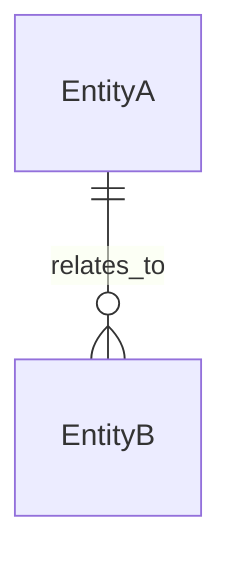
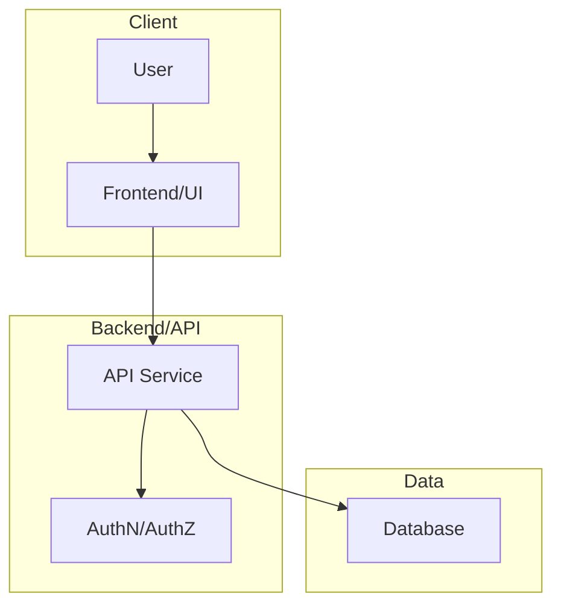
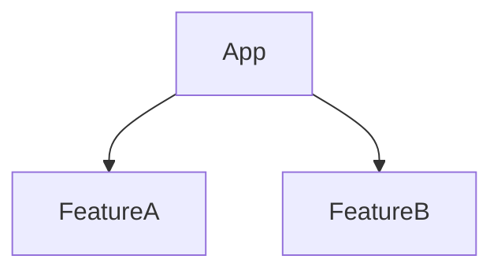

# Product Requirements Document (PRD) — Unified Template (AI/Cursor-friendly)
>
> **Purpose**: One canonical PRD structure that combines (a) classic product requirements, (b) implementation-ready technical context, and (c) PRD → Plan → Todo workflow guidance—without duplicating sections.
>
> **How to use**: Fill this file top-to-bottom. If a section is not relevant, mark it **N/A** and explain why (briefly).

---

## Document Metadata

- **Product / Feature Name**:
- **Owner (PM)**:
- **Tech Lead**:
- **Design Lead**:
- **Stakeholders / Approvers**:
- **Status**: 🟢 Active | 🟡 In Review | 🔴 On Hold
- **Version**: (e.g., v1.0 Draft)
- **Last Updated**:
- **Canonical Location**: (repo path / knowledge base link)

---

## 1) Executive Summary (What & Why)

- **Context & Background**:
- **Problem (1–3 sentences)**:
- **Solution (2–3 sentences; what it does, not how)**:
- **Primary Value Propositions (3–5)**:
  -
  -
  -
- **Strategic Alignment** (how it supports broader strategy):

---

## 2) Scope Definition (Boundaries)

- **In Scope** (5–7 concrete items):
  -
  -
- **Out of Scope** (3–5 explicit non-goals; prevent scope creep):
  -
  -
- **Future Considerations / Phase 2+**:
  -
  -

---

## 3) Goals, Success, and Constraints (Outcome-first)

### 3.1 One-Line Project Framing

```text
Make me a [TYPE OF PROJECT]
for [WHO IT'S FOR]
that helps [GOAL / PROBLEM]
by doing [WHAT IT DOES]
```

### 3.2 Primary Goal (Goal, not process)

```text
[Primary Goal]: I need [output type] that [accomplishes what]

[Context]: This is for [audience/domain], where [what matters]

[Examples & Performance]: Success means [observable outcome], not [failure]

[Constraints]: Focus on [priority], avoid [anti-priority]

[Outcome]: The reader should [what they'll be able to do after]
```

### 3.3 Definition of Success (High-level)

- **Business success**:
- **User success**:
- **Technical/operational success**:

### 3.4 Hard Constraints (Non-negotiables)

- **Time**:
- **Budget / resourcing**:
- **Compliance / privacy**:
- **Compatibility / platforms**:
- **Style / UX / accessibility** (e.g., WCAG 2.1 AA):

---

## 4) Target Market & User Analysis

### 4.1 Ideal Customer Profile (ICP) (if applicable)

- **Company characteristics**: size, industry, geography
- **Technology profile**: current stack, integration requirements, technical maturity
- **Business context**: pain points, existing solutions/workarounds, budget range, buying process
- **ICP success criteria**: desired outcomes, time-to-value expectations

### 4.2 Personas (2–4 primary personas)

For each persona:

- **Name**:
- **Role / responsibilities**:
- **Goals & motivations**:
- **Frustrations & pain points**:
- **Environment & tools**:
- **Definition of success (persona-specific)**:

---

## 5) User Stories, Flows, and Acceptance Criteria

### 5.1 User Stories (MANDATORY format)

All user stories must use:

> As a **[type of user]**, I want **[some goal]** so that **[some reason]**.

- **Story 1**:
- **Story 2**:
- **Story 3**:

### 5.2 Critical User Flows (3–5 journeys)

For each workflow:

- **Workflow name**:
- **Steps**:
  - Step 1:
  - Step 2:
  - Step 3:
- **Success scenario** (ideal path):
- **Edge cases & exceptions**:
  - Validation errors
  - Timeouts / service failures
  - Permissions / access issues
- **Acceptance criteria** (specific & testable):
  - Given / When / Then statements, or bullet list

---

## 6) Requirements (What must be built)

### 6.1 Feature Requirements (Core)

For each feature:

- **Feature name**:
- **Overview** (purpose & high-level behavior):
- **Priority**: Critical / High / Medium / Low (with justification)
- **Complexity**: Simple / Moderate / Complex / Very Complex
- **User value**: qualitative or numeric, with reasoning

**Functional requirements**:

1. Core functionality
2. User interactions
3. Business rules

**Edge cases**:
- 
- 

**Acceptance criteria**:
- [ ] 
- [ ] 

**Design artifacts**:
- Links to Figma / sketches / wireframes:

### 6.2 Non-Functional Requirements (NFRs)

- **Performance**: response-time targets, throughput/concurrency, scalability needs
- **Security**: auth strategy, authorization model, OWASP, input validation, audit logging
- **Reliability**: uptime target, error-rate target, recovery time target
- **Accessibility & usability**: WCAG target, responsiveness, supported browsers/devices
- **Maintainability**: code quality standards, logging/observability, documentation requirements

### 6.3 Dependencies & Integrations

- **External services**:
- **Internal systems**:
- **Third-party libraries**:
- **Integration points** (APIs, webhooks, queues):

---

## 7) Data, Domain, and Terminology

### 7.1 Glossary & Definitions

Briefly define critical domain-specific terms so stakeholders share the same language.

- **Key terms**:
  - **Workspace**:
  - **Artifact**:
  - **Collaborator**:
  - **Subscription Tier**:
  - **[Other project-specific terms]**:

### 7.2 Domain Model / Ontology (optional but recommended for complex domains)

#### Core entities

- **Entity: [EntityName]**
  - **Properties**: `property`: type — description
  - **Relationships**: how it links to other entities

#### Domain model diagram (optional)



---

## 8) Architecture, Tech Stack, and Interfaces (Implementation context)

### 8.1 System Architecture (High-level)



### 8.2 Technology Stack (Decisions & Rationale)

- **Frontend**: framework + rationale
- **Backend**: platform + rationale
- **Database**: engine + rationale
- **Auth**: JWT/sessions/OAuth + role/permission model
- **Hosting & infra**: provider, regions, deployment strategy
- **CI/CD**: tools + environments (dev/staging/prod)
- **Dev tools**: testing, linting, formatting

### 8.3 API Design (if relevant)

- **Endpoint list** (method + path + purpose)
- **Request schema**: parameters/body + validation rules
- **Response schema**: success + standardized error format
- **Auth requirements**: public vs authenticated vs admin-only
- **Rate limiting policies**:

### 8.4 Database Schema (if relevant)

- **Tables**: columns, types, constraints
- **Relationships**: foreign keys, indexes, cardinality
- **RLS policies** (if applicable):
- **Seed data**:
- **Migration strategy**:

---

## 9) Codebase Structure & Components (for engineering alignment)

### 9.1 Expected Directory Layout (example)

```text
project-root/
├── README.md
├── src/ (or app/)
│   ├── components/
│   ├── pages/ (or app/)
│   ├── lib/
│   ├── types/
│   └── styles/
├── database/ (optional)
└── docs/ (optional)
```

### 9.2 Component Hierarchy (optional)



---

## 10) Quality Assurance & Testing Strategy

### 10.1 Testing Approach

- **Unit testing**: scope, frameworks, coverage targets
- **Integration testing**: APIs, external services
- **UAT**: scenarios, stakeholders, sign-off criteria
- **Performance/load testing**: targets, tools, scenarios
- **Security testing**: scanning, penetration testing (if required)

### 10.2 Quality Gates

- **Code quality standards**: linting/formatting/complexity thresholds
- **Coverage requirements**:
- **Performance benchmarks**:
- **Security requirements**:
- **UX/accessibility standards**:

---

## 11) Delivery Plan

### 11.1 Task Breakdown (with effort)

All tasks must include an **effort estimate** (S/M/L or days), dependencies, and acceptance criteria.

- **Infrastructure & setup**
  - Task:
    - Description:
    - Effort:
    - Dependencies:
    - Acceptance criteria:
- **Frontend**
  - Task:
- **Backend**
  - Task:
- **QA**
  - Task:

### 11.2 Impact–Effort Matrix (optional)

- **Quick wins (High impact, Low effort)**:
- **Major projects (High impact, High effort)**:
- **Fill-ins (Low impact, Low effort)**:
- **Avoid / reassess (Low impact, High effort)**:

### 11.3 Roadmap & Milestones

- **Phase 1 – Foundation**: goals, deliverables, entry/exit criteria
- **Phase 2 – Core functionality**:
- **Phase 3 – Enhancements & scale**:
- **Phase 4 – Optimization & hardening**:

---

## 12) Metrics & KPIs (Measurement framework)

### 12.1 Business Metrics

- Revenue impact (ARR, conversion, upsell/cross-sell)
- Customer metrics (CAC, retention, NPS/CSAT)
- Operational efficiency (cost/time savings)
- Market position (if applicable)

### 12.2 Product & User Metrics

- Adoption (activation, new users)
- Engagement (feature usage)
- Quality (error/crash rates, uptime)
- UX indicators (task completion, support tickets)

### 12.3 Technical Metrics

- Performance (P95/P99 latency)
- Reliability (SLOs, incidents)
- Development velocity (lead time, deploy frequency)
- Security & compliance (vuln backlog)
- Cost/scalability (cost per user/event)

### 12.4 KPI Table (fill-in)

| KPI | Baseline | Target | Data source | Cadence | Trigger |
|-----|----------|--------|-------------|---------|---------|
|     |          |        |             |         |         |

---

## 13) Risks, Assumptions, and Open Questions

### 13.1 Risks & Mitigations

- **Risk**:
  - Impact:
  - Likelihood:
  - Mitigation:

### 13.2 Assumptions

- 
- 

### 13.3 Open Questions (must be resolved)

- [ ] 
- [ ] 

---

## 14) Review, Approval, and Change Log

### 14.1 Review & Approval

- **Required approvers**: PM, Tech Lead/Eng Manager, Design Lead, other stakeholders
- **Review process**: async/sync, review window (e.g., 48h), how feedback is captured/resolved

### 14.2 Change Log

| Date | Version | Changes | Author |
|------|---------|---------|--------|
|      |         |         |        |

---

## Appendix A) PRD → Plan → Todo (Workflow Guidance)

### A.1 Why PRD → Plan → Todo works (documentation-first development)

- Writing requirements forces edge cases to surface before implementation.
- Clear PRDs improve downstream planning and “todo-ization”.
- Todo lists enable measurable progress tracking and reduce scope creep.

### A.2 “For AI agents reading this PRD” (operational guidance)

- Treat this PRD as the single source of truth.
- When implementing features: **read the relevant section first**, align with requirements, then implement and verify against acceptance criteria.
- If requirements are ambiguous: use the discovery flow below and record answers in **Open Questions** / **Assumptions**.

### A.3 System Q&A Discovery Flow (requirements decomposition)

- **Define goal, not process** (use section 3.2).
- **5 W’s + How**:
  - Who are the users?
  - What are we building?
  - Where does it run?
  - When is it used?
  - Why does it exist?
  - How does it work (at a high level)?
- **Decomposition workflow** (for uncertain/problem-solving work):
  - Align observed symptom
  - Generate a fault tree (3 levels deep)
  - Identify information gaps
  - Capture next diagnostic step

### A.4 Converting PRD → Plan → Todo (linkage)

- **From PRD to Technical Plan**: derive architecture, components, database schema, APIs, background jobs, and frontend modules from sections 6–9.
- **From Plan to Todos**: convert section 11 into granular tasks with estimates, dependencies, and acceptance criteria.
- **Tracking & checkpoints**: use roadmap phases as checkpoints for progress (and rollback points, if needed).

